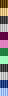
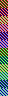

# No Packsaran!

A program to make images that are hard to generate palettes for.

(See the [Acknowledgements](#acknowledgements) below for a link to a packing algorithm that processes them with flying colours (pun intended))

## Context and Motivation

Older game consoles often can't display images containing “raw” pixel values, instead relying on the creation of several “colour palettes” that get applied to portions to the image.
Complicating matters is that said consoles often could only contain few of these palettes.

While the transformation from the latter to the former is trivial, which makes rendering simple, the inverse operation is difficult (and sometimes outright impossible within the consoles' constraints).

> [!TIP]
> The problem is a generalisation of bin-packing, which has been proven to be NP-hard.
> 
> In layman's terms: there are many images for which calculating the smallest number of palettes necessary to render it takes a *lot* of time.

Nonetheless, many programs have been developed over the years that attempt to tackle this exact problem, so that people can make games for those consoles.
(Two examples of those are RGBGFX, part of [RGBDS]; and [SuperFamiconv]).
These programs use various algorithms to try packing palettes, often naive ones.

The goal of **No Packsaran!** is to help spread awareness that these algorithms can be flawed, [including by seemingly innocuous images](https://github.com/Rangi42/tilemap-studio/issues/86).

Please don't use these to shame any of the tools' authors!
Instead, send them a PR that improve the packing algorithm—I'm sure that would make them happy :)

## How to use

This program is written in [Rust], so you'll need that.
Once Cargo is set up, the usual `cargo run` command (from your terminal) will get you started; use `cargo run -- --help` to obtain the CLI help.

Alternatively, these are the two images that get generated with default settings:

<code>cargo run -- any_fit</code>

<code>cargo run -- best_fusion</code>

If you need different settings (currently, the bit depth and size of the tiles can be changed), you will have to run the program yourself.

## Acknowledgements

The techniques implemented in this program are described in the paper [Algorithms for the Pagination Problem, a Bin Packing with Overlapping Items](https://arxiv.org/abs/1605.00558), by Aristide Grange, Imed Kacem, and Sébastien Martin.

That paper also contains an algorithm, Overload-And-Remove, that can be implemented [without too much difficulty](https://github.com/gbdev/rgbds/blob/fb6f861a08231f26d386e21b4a434f645ae3b357/src/gfx/pal_packing.cpp#L355-L537), and performs much better than the usual greedy algorithms, while remaining fast.

## License

This program is licensed under the GNU Affero General Public License v3.0 or, at your option, any later version.

Copyright 2024, Eldred “ISSOtm” Habert.
Feel free to reach me at my commit email for any questions.

[RGBDS]: https://rgbds.gbdev.io
[Rust]: https://rust-lang.org
[SuperFamiconv]: https://github.com/Optiroc/SuperFamiconv#readme
